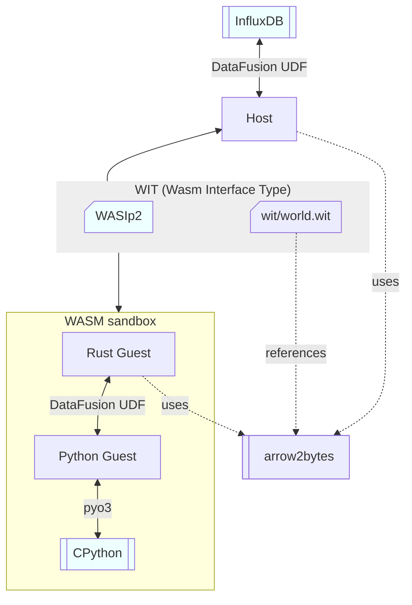

# DataFusion UDFs using WASM

## UDF Types
This section discusses the different types of _User Defined Functions_ (UDFs) that are currently available in [Apache DataFusion].

### "UDF": Scalar
Use to map scalar values of 0, 1, or more columns to 1 output column:

```sql
SELECT my_udf(col1, col2)
FROM t;
```

Comes in a sync flavor ([`ScalarUDF`]) and an async flavor ([`AsyncScalarUDF`]).

### "UDAF": Aggregate
Used to aggregate values of 0, 1, or more columns into 1 output scalar:

```sql
SELECT my_udaf(col1, col2)
FROM t
GROUP by col3;
```

Only has a sync flavor so far ([`AggregateUDF`]).

### "UDWF": Window
Use for window functions and has 0, 1, or more columns as input and 1 output column:

```sql
SELECT my_udwf(col1, col1) OVER (PARTITION BY col3 ORDER BY col4)
FROM t;
```

Only has a sync flavor so far ([`WindowUDF`]).

### User Defined Table Transformation (to-be-implemented)
This takes an entire table and emits another (virtual) table. In some sense, it kinda acts like a _Common Table Expression_ ([CTE]) or a [View]. We still have to determine how the API/UX for this should look like.

## The Python Moonshot Vision
A user writes their _UDF_ in [Python].

### Use Cases
Example use cases that will be enabled:

- **Custom Business Logic:** A user can implement their own business logic functions and do not need to wait for the database vendor to implement every single method that they require.
- **Retrieve Remote Data:** Retrieve data from their own HTTP endpoint, e.g. look up IP address locations, run LLM inferences, run classifications.
- **Exfiltrate Data:** Send data to an external endpoint, e.g. for auditing.

It essentially fills a hole that [Flux] left behind, which enabled two broader usage patterns:

- **Complex scripts/queries:** Queries that are not covered by the builtin InfluxQL/SQL methods. Currently there is no replacement for that in [InfluxDB 3].
- **Tasks:** Data processing outside of queries. This – to some extent – is now available via the [InfluxDB 3] [Processing Engine].

### Source Code
```python
def add_one(x: int) -> int:
    return x + 1
```

Either during the query (stateless) or via an earlier API call (stateful), the customer sends the [Python] source text to the querier together with the information about the _UDF_ type (see previous section). The _UDF_ can then be used during the query.

The user can use a simple [Python] function without having to worry about the mapping to/from [Apache Arrow]. We however require type annotations for the [Python] code.

### Dependencies
The user cannot install new [Python] dependencies, but we shall provide a reasonable library by default (at least the [Python Standard Library], potentially a few selected other libraries).

### I/O
Depending on the cluster configuration and user permissions, the user MAY perform network IO, e.g. to pull data from an external resource, to interact with hosted AI tools, to exfiltrate data as they see fit.

### Sandboxing
The [Python] interpreter is sandboxed in a [WebAssembly] VM. Due to the nature of [Python], it is generally considered bad practice to sandbox using the interpreter alone.

## Implementation Plan
This section describes a rough implementation strategy.

### Two Sides
We will try to approach the issue from two sides:

- **Fast UDF:** Use a pure [Rust] guest to demonstrate how fast/small/good a WASM UDF can be. Especially use this to tune the dispatch logic and data exchange formats. This will act as a performance baseline to see how far we could – in theory – push the [Python] guest.
- **Good UX:** Build a version that has the optimal user experience for [Python] guests. Optimize the experience first, then improve performance. Use the "Fast UDF" baseline to see where we stand.

### Crates
Here is how the crates in this repository are organized:



### Fail Forward
[WebAssembly], the tooling around it, and guest language support are a moving target. Many things are bleeding edge. In some cases, we can choose between "somewhat working legacy approach" (like WASIp1 or the legacy exception handling in WASM) or "future-proof but not always implemented" (like WASIp2 in [Rust] or the upcoming exception handling in [wasmtime]). We want to create something that will be used for a while and that has a sound technical foundation. Hence, we should use the 2nd option and rather deal with a few issues now but get a future-proof foundation in return.

## Prior Art
- **DataFusion – WASM UDFs:** <https://github.com/apache/datafusion/issues/9326>
- **Apache Arrow in WebAssembly:**
  - <https://github.com/domoritz/arrow-wasm>
  - <https://github.com/kylebarron/arrow-wasm>
- **Extending Seafowl with WebAssembly:** <https://www.splitgraph.com/blog/seafowl-wasm-udfs>
- **InfluxDB 3 – Embedded Python VM, Plugins and UDFs:** <https://github.com/influxdata/influxdb/issues/25537>

## License
Licensed under either of these:

- Apache License, Version 2.0 ([LICENSE-APACHE](LICENSE-APACHE) or <https://www.apache.org/licenses/LICENSE-2.0>)
-  MIT License ([LICENSE-MIT](LICENSE-MIT) or <https://opensource.org/licenses/MIT>)

### Contributing
Unless you explicitly state otherwise, any contribution you intentionally submit for inclusion in the work, as defined
in the Apache-2.0 license, shall be dual-licensed as above, without any additional terms or conditions.


[Apache Arrow]: https://arrow.apache.org/
[Apache DataFusion]: https://datafusion.apache.org/
[CTE]: https://www.postgresql.org/docs/current/queries-with.html
[Flux]: https://docs.influxdata.com/flux/v0/
[InfluxDB 3]: https://docs.influxdata.com/influxdb3/enterprise/
[Processing Engine]: https://docs.influxdata.com/influxdb3/enterprise/plugins/
[Python]: https://www.python.org/
[Python Standard Library]: https://docs.python.org/3/library/index.html
[Rust]: https://www.rust-lang.org/
[View]: https://www.postgresql.org/docs/current/tutorial-views.html
[wasmtime]: https://wasmtime.dev/
[WebAssembly]: https://webassembly.org/

[`AggregateUDF`]: https://docs.rs/datafusion/latest/datafusion/logical_expr/struct.AggregateUDF.html
[`AsyncScalarUDF`]: https://docs.rs/datafusion/latest/datafusion/logical_expr/async_udf/struct.AsyncScalarUDF.html
[`ScalarUDF`]: https://docs.rs/datafusion/latest/datafusion/logical_expr/struct.ScalarUDF.html
[`WindowUDF`]: https://docs.rs/datafusion/latest/datafusion/logical_expr/struct.WindowUDF.html
